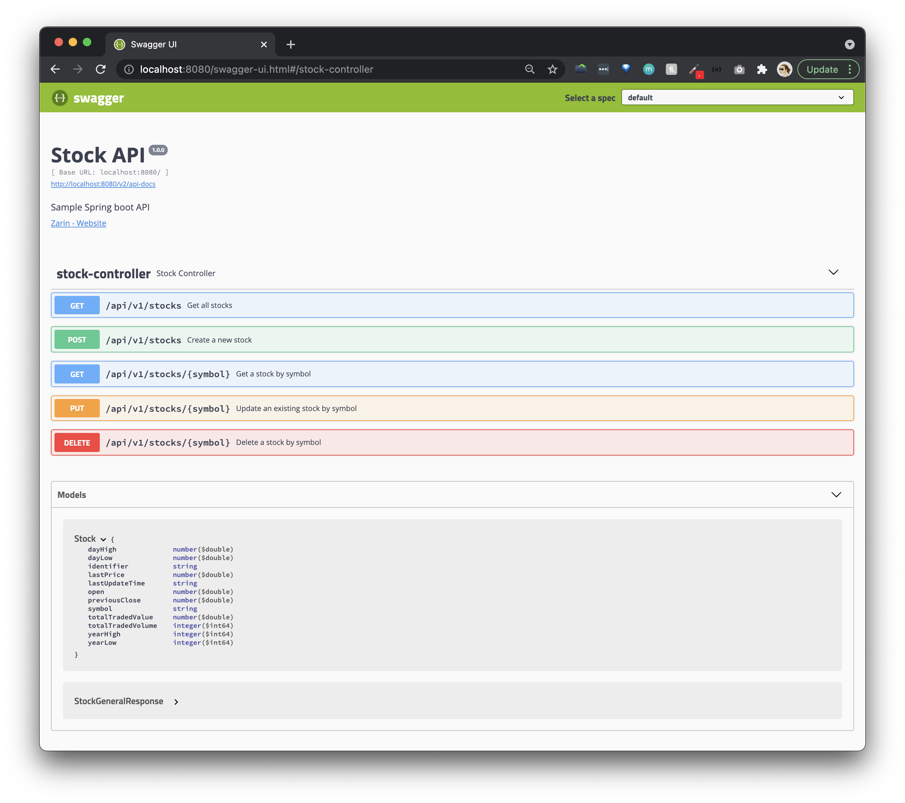

[](https://circleci.com/gh/zarinlo/sample-springboot-api/tree/master)
[](https://hub.docker.com/r/zarinlo/springboot-api)

# Sample Spring Boot API using Remote MongoDB Atlas
- [Quick Intro](#quick-intro)
- [Guides](#guides)
- [Software](#software)
- [Run API via IDE](#run-api-via-ide)
- [Run API via Command Line](#run-api-via-command-line)
    * [Windows](#windows)
    * [MacOS](#macos)
- [Swagger](#swagger)
- [Spring Actuator Endpoints](#spring-actuator-endpoints)

# Quick Intro

This sample Java Spring Boot API will show how the following components function together: 

| Components | Usage |
| --- | --- |
| Controller | Manages all the REST calls and status codes |
| Service | Business logic layer that handles any manipulation of data required |
| Repository | Using a Java Persistence API (JPA) that analyzes all the methods defined by an interface and automatically generates queries from the method names, we will connect to a MongoDB cluster used by the Service |
    
- The database (i.e. MongoDB Atlas cluster) is populated once the backend is initialized with data provided by the "Latest Stock API": https://rapidapi.com/suneetk92/api/latest-stock-price/
- The sample API key used to obtain sample data for this demo is: `9e87a2c143msh6b92309e36af212p15ccc6jsn2bc37ea481bd`
- The code snippet that populates the database and refreshes the data once a minute is: 
```java
@Scheduled(fixedRate = 60000)
public void populateStockDatabase() throws StocksResponseException { ... }
``` 

# Guides

- [Codelab style guide on how to design and develop this Spring Boot app](https://zarin.io/codelabs/springboot-api/#0)
- [How to setup a CircleCI pipeline for this containerized Spring Boot app connected to MongoDB Atlas](https://faun.pub/setup-a-circleci-pipeline-for-a-containerized-spring-boot-app-93045fa060de)

# Software

| Software | Version | Required | MacOS Guide | Notes
| --- | --- | --- | --- | --- |
| [OpenJDK](https://www.oracle.com/java/technologies/javase-downloads.html) | 16.0.1 | true | [How to setup openjdk via Homebrew](https://johnathangilday.com/blog/macos-homebrew-openjdk/) | If you are using an older version of openjdk (mininum 11+), you can still run this project as long as you set the VM options in the Run Configuration to include: `-Djdk.tls.client.protocols=TLSv1.2`
| [Apache Maven](https://maven.apache.org/download.cgi) | 3.5.3 | true | [Install maven via Homebrew](https://formulae.brew.sh/formula/maven) | [Understanding Apache Maven - The Series](https://cguntur.me/2020/05/20/understanding-apache-maven-the-series/) 
| [MongoDB](https://www.mongodb.com/download-center#community) | 4.2 | false | [Install mongodb-community@4.2 via Homebrew](https://docs.mongodb.com/manual/tutorial/install-mongodb-on-os-x) | Use an embedded version of MongoDB by uncommenting the maven dependency in the root `pom.xml` under `<!--Embedded MongoDB-->`. You will see `Jackson Databind` errors, don't worry.

# Run API via IDE

- [Setup local JDK under Project Settings and Structure in IntelliJ](https://www.jetbrains.com/help/idea/project-settings-and-structure.html)
- [Create Springboot Run Debug Configuration in IntelliJ](https://www.jetbrains.com/help/idea/run-debug-configuration.html) 
    * Under the configuration, there is an attribute called `Active profiles`, set this to `local` to utilize the 
    `application-local.yaml` on startup.
- After you have your environment setup, run the application via the play button in the IDE: [How to run the Springboot App in IntelliJ](https://www.jetbrains.com/help/idea/running-applications.html)

# Run API via Command Line

- If you don't want to run the application from the IDE, then you can run it from a unix emulator (i.e. Git Bash, Cmder) or Terminal (MacOS).
- Run the following bash commands in the root directory of this project.

### Windows
```bash
mvnw.cmd clean install
mvnw.cmd spring-boot:run -Dspring-boot.run.arguments=--spring.profiles.active=local
```

### MacOS
```bash
./mvnw clean install
./mvnw spring-boot:run -Dspring-boot.run.arguments=--spring.profiles.active=local
```

# Swagger

- Swagger 3.0 is configured under `SwaggerConfig.java`.
- Swagger UI: http://localhost:8080/swagger-ui/index.html

- Swagger API spec 2.0: http://localhost:8080/v2/api-docs
- Open API spec 3.0.3: http://localhost:8080/v3/api-docs
- Stock data: http://localhost:8080/api/v1/stocks

# Spring Actuator Endpoints 

- The actuator endpoints are configured under the `application.yaml` file. 
- Health: http://localhost:8080/health
- Metrics: http://localhost:8080/metrics
- Mappings: http://localhost:8080/mappings
